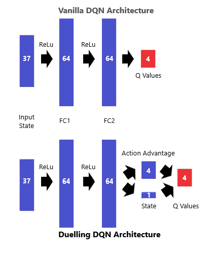
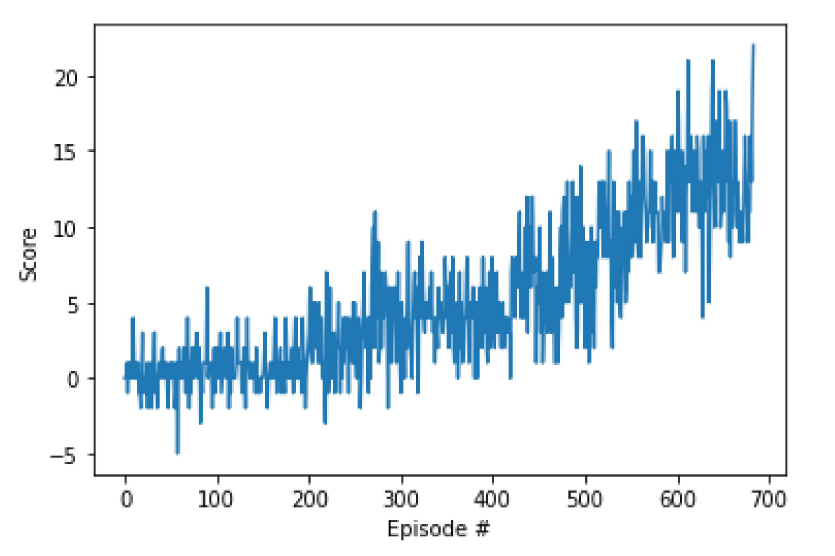

# Report

### Deep Q Learning
Deep Q learning is an off-policy learning algorithm which aims to learn an optimal policy through learning the value of 
each action in a given state. In order to do this it utilizes a neural network which receives the state information as
input and returns a list of Q values corresponding to the expected cumulative reward for each action. Q Learning is a 
form of Temporal Difference learning, meaning that the agent can learn at each timestep as opposed to learning only 
after a full episode.

In this implementation we use a Deep Q Learning alogrithm to teach an agent to navigate a virtural envrironment. Further
information on the environment can be found in the attached `README.md`. Deep Q Learning in its original implementation 
is quite unstable and often fails to converge due to correlations, both between experiences and within the update 
function itself. We will therefore use two common modifications to address these issues. 

In order to avoid correlated experiences (where the sequence of experiences during each learning step is determined by
previous actions) we will implement experience replay. This is where an agent stores multiple experiences and afterwards 
samples from them randomly. 

The second type of correlation arises from the fact that the update step calculates the gradient of the weights `w`, 
using the weights themselves as a parameter. In order to adress this we introduce a second set of network weights which 
are not updated during the learning step. Instead, they are updated at regular intervals. This is known as fixed Q targets.

### Learning Algorithm
The basic Deep Q algorithm with experience replay involves several steps:
1. The agent chooses some arbitrary initial weights for the local and target networks.
2. When the environment is loaded the agent receives information about the initial state.
3. It receives the Q values (expected cumulative reward) for each action by feeding the current state through the neural
   network.
4. It then uses these Q values to select an action using the epsilon-greedy strategy.
5. It passes this action to the environment and receives a reward and a new state.
6. The state, action, reward, new state tuple is stored in the agent's memory.
7. After completing a number of actions the agent then updates its local network by sampling randomly from its memory
   and comparing its expected reward with the actual reward it received.
8. It then updates the weights of its local network using the Bellman equation.
9. Every N steps it copies the weights from the local network to the target network.

This implementation uses a number of modifications to the vanilla Deep Q approach.
- <b>Double DQN:</b> Q Learning is prone to overestimating action values. This can be a problem, particularly in the early
  stages of learning where Q values are noisy. One modification that can be made is to select the best action using one
  set of parameters (local network) but to evaluate it using another set (target network). If they do not agree then it
  will return a lower Q value. This helps to avoid incidental high rewards that occur through chance.
- <b>Duelling Q Networks:</b> In Deep Q Learning we often find that many states don't vary a lot across actions. If an
  agent has fallen off a cliff, the state (and future states) are most likely bad, regardless of how the agent chooses to
  act. Duelling Q Networks address this issue by splitting the final layers of the nerual network so that one stream
  estimates the state value and another estimates the advantage of each action. In the final layer we subtract the
  action advantage mean from each of the advantage values and add them to the state value to get our final Q.
- <b>Prioritised Experience Replay:</b> When an agent samples experiences from the memory buffer it usually does so
  uniformly. However, this means that there may be certain important but rare experiences which are missed altogether.
  In order to avoid this we can add a priority value to each of the experience tuples which corresponds to the TD error for
  that experience. When selecting experiences we do so with probability equal to their priority value divided by the sum
  of all the priority values in the replay buffer. When a tuple is selected we update its priority with the new TD error
  using the new Q values. 
  In order to prevent the agent from repeating a small set of high-priority experiences over-and-over, we will reintroduce
  some element of uniform sampling. This is done using a new hyperparameter `a` which will defines the sampling probability
  (a=1: pure priority | a=0: pure uniformity). We will also introduce an importance sampling weight to correct for the bias
  in sampling during the update step. We will therefore include a hyperparameter `b` which determines how much the
  sampling weights affect learning.

<i>Note: Although the code for Prioritised Experience Replay is included in `Navigation.ipynb`, it runs extremely slowly and is therefore not
used for the resulting output.</i>

### Hyperparameters
In this implementation, there are a number of hyperparameters which can be further tuned to optimise the agent's performance.

<table>
   <tr>
                 <td><b>Name</b></ td> 
                 <td><b>Type</b></ td>
                 <td><b>Description</b></ td>
                 <td><b>Value</b></ td>
   </tr>
   <tr>
                 <td colspan = "4"><i><b>Network Architecture</b></i></ td>    
   </tr>
   <tr> 
               <td>fc1_units</td>
               <td>int</td>
               <td>number of nodes in layer 1 of the neural network</td>
               <td>64</td>
   </tr>
   <tr> 
               <td>fc2_units</td>
               <td>int</td>
               <td>number of nodes in layer 2 of the neural network</td>
               <td>64</td>
   </tr>   
    <tr>
                 <td colspan = "4"><i><b>Learning Parameters</b></i></ td>    
    </tr>
   <tr> 
               <td>buffer_size</td>
               <td>int</td>
               <td>maximum number of experience tuples to store in the memory buffer</td>
               <td>100000</td>
   </tr>
   <tr> 
               <td>batch_size</td>
               <td>int</td>
               <td>number of experiences to sample during learning</td>
               <td>128</td>
   </tr>
   <tr> 
               <td>alpha</td>
               <td>float</td>
               <td>learning rate (how much we want the agent to change its weights on each update)</td>
               <td>0.001</td>
   </tr>
   <tr> 
               <td>gamma</td>
               <td>float</td>
               <td>discount parameter (how we you want the agent to consider future rewards vs immediate)</td>
               <td>0.999</td>
   </tr>
   <tr> 
               <td>tau</td>
               <td>float</td>
               <td>interpolation parameter</td>
               <td>0.001</td>
   </tr>
   <tr> 
               <td>local_update_every</td>
               <td>int</td>
               <td>number of actions to take before updating local network weights</td>
               <td>1</td>
   </tr>
   <tr> 
               <td>target_update_every</td>
               <td>int</td>
               <td>number of actions to take before updating target network weights</td>
               <td>5</td>
   </tr>
   <tr>
               <td colspan = "4"><i><b>Episode Parameters</b></i></ td>    
   </tr>
   <tr>
               <td>eps_start</td>
               <td>float</td>
               <td>intial value for epsilon</td>
               <td>1.0</td>
   </tr>
   <tr>
               <td>eps_decay</td>
               <td>float</td>
               <td>the amount epsilon will decay each turn</td>
               <td>0.01</td>
   </tr>
   <tr>
               <td>eps_end</td>
               <td>float</td>
               <td>the minimum value of epsilon</td>
               <td>0.995</td>
   </tr>
   <tr>
               <td>max_t</td>
               <td>int</td>
               <td>the maximum number of time steps before terminating an episode</td>
               <td>1000</td>
   </tr>
   <tr>
               <td colspan = "4"><i><b>Priority Experience Replay Parameters</b></i></ td>    
   </tr>
   <tr>
               <td>a</td>
               <td>float</td>
               <td>sampling probability (0=random | 1=priority)</td>
               <td>1</td>
   </tr>
   <tr>
               <td>b</td>
               <td>float</td>
               <td>influence of importance sampling weights over learning
</td>
               <td>0.3</td>
   </tr>
   <tr>
               <td>b_increase</td>
               <td>float</td>
               <td>amount to increase b by every learning step</td>
               <td>0.001</td>
   </tr>
   <tr>
               <td>b_end</td>
               <td>float</td>
               <td>maximum value for b</td>
               <td>1.0</td>
   </tr>
</table>

### Neural Network Architecture
The network comprises of two fully connected layers of 64 units each. The network receives an input state size 37 and 
feeds forward through two fully connected layers using ReLu activation functions. In the vanilla DQN a third fully 
connected layer maps to the output Q values. In the Duelling Q Network architecture this layer is split into two paths, 
where one path will map to the state value while another produces advantage values for each action. These are then 
combined in an additional layer which subtracts the action advantage mean from each advantage value and adds it to the 
state value to produce the Q values.

### Results
The agent was able to solve the environment and achieve an average reward of >13 (over 100 episodes) in 584 episodes. 
The resulting output is displayed below.
- Episode 100	Average Score: 0.41
- Episode 200	Average Score: 0.77
- Episode 300	Average Score: 3.00
- Episode 400	Average Score: 4.01
- Episode 500	Average Score: 6.09
- Episode 600	Average Score: 9.91
- Episode 684	Average Score: 13.06
- Environment solved in 584 episodes!	Average Score: 13.06

### Ideas for Future Work
Some ideas for future work are as follows:
- This implementation could benefit from a more computationally efficient method of prioritised replay. Sum trees are commonly 
  used in DQN Prioritised Experience Replay and have been shown to be effective in improving the speed of training. It 
  is uncertian how much prioritisation would improve learning however.
- Further tuning some of the hyperparameters would improve network performance, however this is a time-consuming process. 
  One solution may be to use an algorithm to tune the hyperparameters automatically. It is possible that this could be 
  done through adapting some of the code in `Hill_Climbing.ipynb` for hyperparameter uning. Although running the network over many
  iterations would take a long time, using this code would mean it could be done independent of human supervision.
- Further tuning our learning parameters would mean that the agent could perhaps run as effectively on a smaller network, 
  therefore reducing the number of weights updated and greatly improving speed.
- In addition to the 3 modifications listed in this notebook, there are some additional methods which have been found to 
  improve network performance. These are Noisy DQN, Distributional DQN and multi-step bootstrap targets. While these 
  methods have all been found to individually improve learning, when implemented alongside one another they show even 
  better improvement than individually. This combined method is known as [Rainbow](https://arxiv.org/abs/1710.02298) 
  and has been found to outperform other methods on Atari games. Implementing Rainbow may allow the agent to solve this 
  task in much fewer episodes.