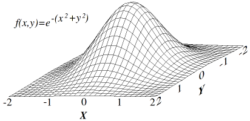

[//]: # (Image References)

[image1]: https://user-images.githubusercontent.com/10624937/42135683-dde5c6f0-7d13-11e8-90b1-8770df3e40cf.gif "Trained Agent"

# Hill Climbing

### Introduction
[Hill Climbing](https://en.wikipedia.org/wiki/Hill_climbing) is an optimisation technique that seeks to find the optimal
soltuion by making incremental changes to the way it solves a problem and remembering which changes led to better results. 
This approach can be broken down into 5 steps:
1. We initialise an agent with a set of weights. The weights determine the action the agent will taken when it receives 
   a given state as input.
2. We collect a single episode using the initial weights and record the return.
3. We add some random noise to the weights.
4. We collect a new episode using the new weights. If the new weights lead to a better return we keep them. If not then 
   we go back to the old weights.
5. Repeat steps 3 & 4.   

Hill climbing can be understood as a simpler form of gradient ascent. We have a reward function that we want to maximise 
by adjusting the paramaters, leading to incremental increases. If we imagine that our reward function only has two 
parameters, we can visualise this as climbing a hill in order to reach the optimal solution.

There are several modifications to hill climbing which can be implemented in this notebook. These help to prevent 
unstable learning and improve the likelyhood of converging at the optimal solution.
- <b>Steepest Ascent:</b> When we run steps 3 & 4 we can run the same episode using multiple sets of weights and select 
  the best option. This will point us roughly in the direction of the slope.
- <b>Simulated Annealing:</b> We start with a larger noise parameter and then reduce it when we get closer to the optimal 
  solution.
- <b>Adaptive Noise Scaling:</b> We implement simulated annealing, but we also expand our noise parameter in each episode
  where we don't find a better policy.
- <b>Cross Entropy:</b> We implement steepest ascent, but instead of selecting the single best option, we take the top x% 
  of the new weights and average them.
- <b>Evolution Strategy:</b> We employ a similar method as steepest ascent but use a weighted sum of each of the new values
  using the reward received.

### Environment
In this implementation we demonstrate how Hill Climbing can be used to solve a simple balancing task 
([CartPole-v0](https://gym.openai.com/envs/CartPole-v0/)) in [OpenAI Gym](https://gym.openai.com/). In this environment 
a pole is attached by an un-actuated joint to  a cart which moves along a frictionless track. The agent can either move
the cart forward or backwards. The aim is to prevent the pendulum from falling over.

The agent recevies a reward of +1 for each timestep that the pole remains upright. If the pole flals or the cart moves 
more than 2.4 units from the center than the episode terminates.
 a
### Requirements
<li>gym - v0.18.0</li>
<li>matplotlib - v3.3.4</li>
<li>numpy - v1.19.5</li>

### Instructions

Open `Hill_Climbing.ipynb` to see an implementation of hill climbing  with OpenAI Gym's Cartpole environment.

Try to change the parameters in the notebook, to see if you can get the agent to train faster!

### Results

![Trained Agent][image1]